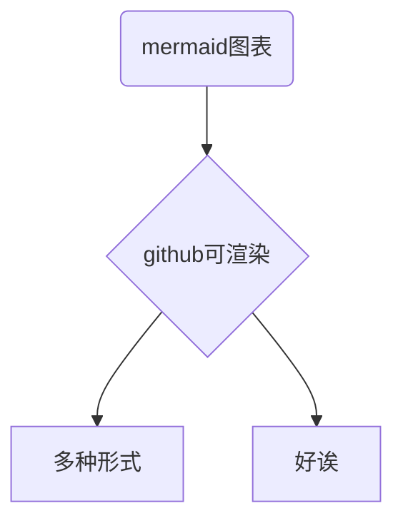

# markdown文档使用示例

# 标题1
## 标题2
### 标题3

## 文本

普通文本

*斜体*

**粗体**

__粗斜体__

~~删除线~~

---

## 列表

- 无序列表
  - 列表项1
    - 列表项1.1

1. 有序列表
  1. 有序1

- [ ] 任务列表
- [x] 已完成

---

## 强制换行

行末两个==空格==

---

## 分割线

`---`  生成一行分割线

## 代码插入

这是一个代码行 `sleep(114514);`  

```cpp
/* 这是一个cpp代码块 */
#include<iostream>
int main() {
	std::cout << "Hello markdown" << std::endl;
}
```



## 表格部分

|表头|表头|
|:---|---:|
|表格内容|表格内容|
|左对齐|右对齐|

## 链接

[普通链接](../README.md)

直接链接:<https://bilibili.com>


[锚点链接][锚点名称]  需要在文末添加对应锚点名称的普通链接

---

## 脚注

1. 添加一个脚注[^01]

[^01]: 脚注内容

---

## 引用
> [!WARNING]
> > 警告段落

> [!NOTE]
> > 笔记段落

---

## 数学公式

$E=mc^2$  这是一个行内公式

多行公式
$$
\frac{-b \pm \sqrt{b^2 - 4ac}}{2a}
$$

- 常用数学符号示例
  - `x^2` 上标 $x^2$  `x_2` 下标 $x_2$
  - `\frac{分子}{分母}`  $\frac{c}{a}$
  - `\sqrt[n]{表达式}`  $\sqrt{b^2 - 4ac}$
  - `\sum_{下限}^{上限}`  累加
  - $\alpha$  $\beta$  $gamma$  $\pi&
    - `$\alpha$  $\beta$  $gamma$  $\pi&`

## github特殊功能

- `owner/repo#456` github功能,自动链接 Issue/PR/Commit
- `@username` 用户和团队提及

<details>
<summary>
可折叠内容
</summary>
这里面什么都没有
</details>
