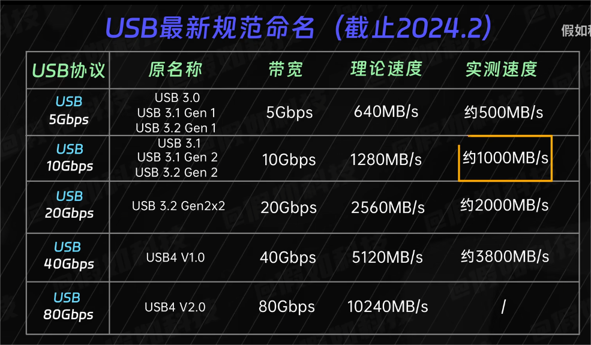
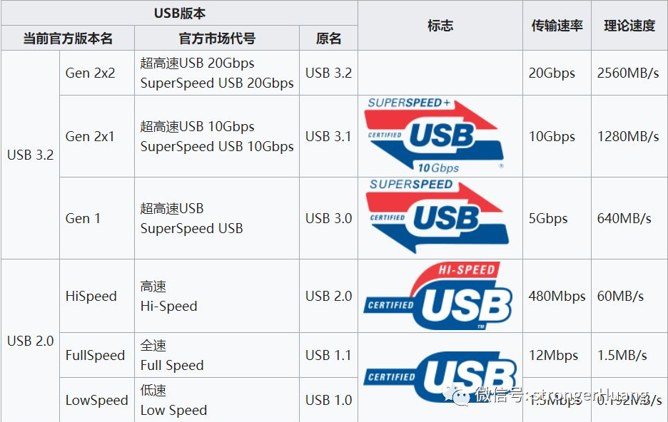
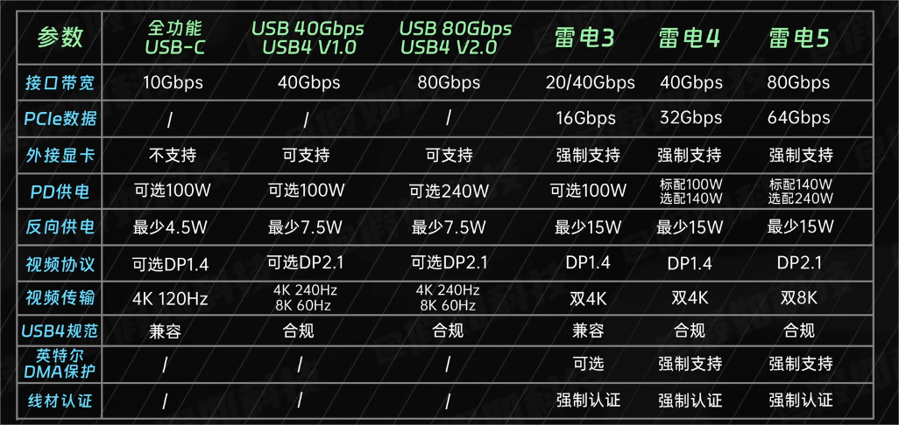

# USB

---

- USB 1.0分为两个版本：
- USB 1.0 Low Speed理论最高速率为1.5Mbit/s或0.1875MBytes/s。
- USB 1.0 Full Speed理论最高速率为12Mbit/s或1.5MBytes/s。

---

- USB 1.1（即USB 1.0 Full Speed）理论最高速率为12Mbit/s或1.5MBytes/s。

---

- USB 2.0分为两个版本：
- USB 2.0 Full Speed（即USB 1.1）理论最高速率为12Mbit/s或1.5MBytes/s。
- USB 2.0 Hi Speed理论最高速率为480Mbit/s或60MBytes/s。

---

- USB 3.0的理论最高速率为5Gbit/s或600MBytes/s。

---

- USB 3.1分为两个版本：
- USB 3.1 Gen 1（即USB 3.0）理论最高速率为5Gbit/s或600MBytes/s。
- USB 3.1 Gen 2理论最高速率为10Gbit/s或1250MBytes/s。

---

- USB 3.2分为三个版本：
- USB 3.2 Gen 1（即USB 3.1 Gen 1）理论最高速率为5Gbit/s或600MBytes/s。
- USB 3.2 Gen 2（即USB 3.1 Gen 2）理论最高速率为10Gbit/s或1250MBytes/s。
- USB 3.2 Gen 2×2（即USB 3.1 Gen 2双通道，仅限Type-C接口）理论最高速率为20Gbit/s或2500MBytes/s。

---

- USB 4分为两个版本：
- USB 4 v1.0（仅限Type-C接口）的理论最高速率为40Gbit/s或5000MBytes/s。
- USB 4 v2.0（仅限Type-C接口）的理论最高速率为80Gbit/s或10000MBytes/s。

---

- 雷电（Thunderbolt）分为五个版本：
- 雷电1代（Thunderbolt 1）理论最高速率为10Gbit/s或1250MBytes/s。
- 雷电2代（Thunderbolt 2）理论最高速率为20Gbit/s或2500MBytes/s。
- 雷电3代（Thunderbolt 3）理论最高速率为40Gbit/s或5000MBytes/s。
- 雷电4代（Thunderbolt 4）理论最高速率为40Gbit/s或5000MBytes/s。
- 雷电5代（Thunderbolt 5）理论最高速率为80Gbit/s或10000MBytes/s。

- __注意：实际传输速度取决于很多方面，而且很难达到理论速度。__

1. 单位换算：1Byte=8bit。
2. 软件方面要求必须正确安装相关驱动。
3. 硬件要求连接的双方都必须支持同种版本的USB或雷电（Thunderbolt）接口，若不同，传输速度则以速度低的一方为基准。
4. 即使连接的双方USB或雷电（Thunderbolt）接口版本相同，不同的存储介质，其速度也不一样。
5. 基于闪存（Flash芯片）存储设备的速度取决于Flash芯片的类型（SLC/MLC/TLC/QLC）和等级、主控芯片、缓存等因素。普通机械硬盘的读写速度取决于盘片的数量、转速和缓存等因素。
6. USB接口有多种颜色，黑色USB接口是USB2.0接口，蓝色USB接口是USB3.0接口（USB 3.1 Gen 1），青绿色和红色USB接口是USB 3.1 Gen 2接口，黄色USB接口是支持关机充电的USB2.0接口，叫做Powered USB。
7. USB接口的外形有Type-A（常见于电脑）、Type-B（常见于打印机）、Type-C（常见于新型号电脑和手机）和Mini USB（Mini-B接口常见于扫描仪）、Micro USB（Micro-B接口常见于安卓手机）等。
