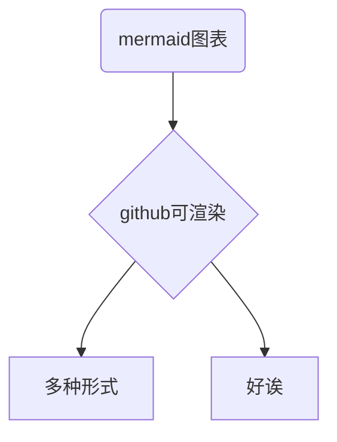

# markdown文档使用示例

**建议源文本和渲染效果对照查看**

以在**github**上的渲染效果为准

## 特殊字体
- 着重点
  - *斜体*
  - **粗体**
  - ***粗斜体***
- 特殊标注
  - ~~删除线~~
  - <u>下划线</u>
  - 脚注[^READ]:this

## 代码插入

这是一个代码行 `sleep(114514);`  

```cpp
/* 这是一个cpp代码块 */
#include<iostream>
int main() {
	std::cout << "Hello markdown" << std::endl;
}
```

## 表格部分

|表头|表头|
|:---|---:|
|表格内容|表格内容|
|左对齐|右对齐|

## 外链接资源


[这是一个链接](链接地址)
    
## 引用
> [!WARNING]
> > 警告段落

> [!NOTE]
> > 笔记段落

## github特殊功能

- `owner/repo#456` github功能,自动链接 Issue/PR/Commit
- `@username` 用户和团队提及

<details>
<summary>
可折叠内容
</summary>
这里面什么都没有
</details>


---
