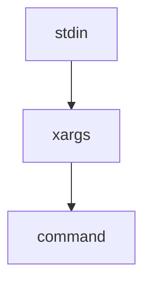

# 这是本仓库文档使用的markdown文档标准

**建议源文本和渲染效果对照查看**

# 这是一个大标题

## 星号越多标题越小

- *斜体*
- **粗体**
- ***粗斜体***

- [ ] 可勾选任务列表
这是一个代码行 `#这里面按代码解释` 可以插入大部分行 

```cpp
/* 这是一个cpp代码块 */
#include<iostream>
int main() {
	std::cout << "Hello markdown" << std::endl;
}
```

|表格|表头|
|---|---|
|表格内容|表格内容|


[这是一个链接](链接地址)
    
~~删除线~~

<u>下划线</u>

[^READ]:脚注

> [!WARNING]
> 警告段落

> [!NOTE]
> 笔记段落

`owner/repo#456` github功能,自动链接 Issue/PR/Commit

`@username` 用户和团队提及

<details>
<summary>
可折叠内容
</summary>
</details>


